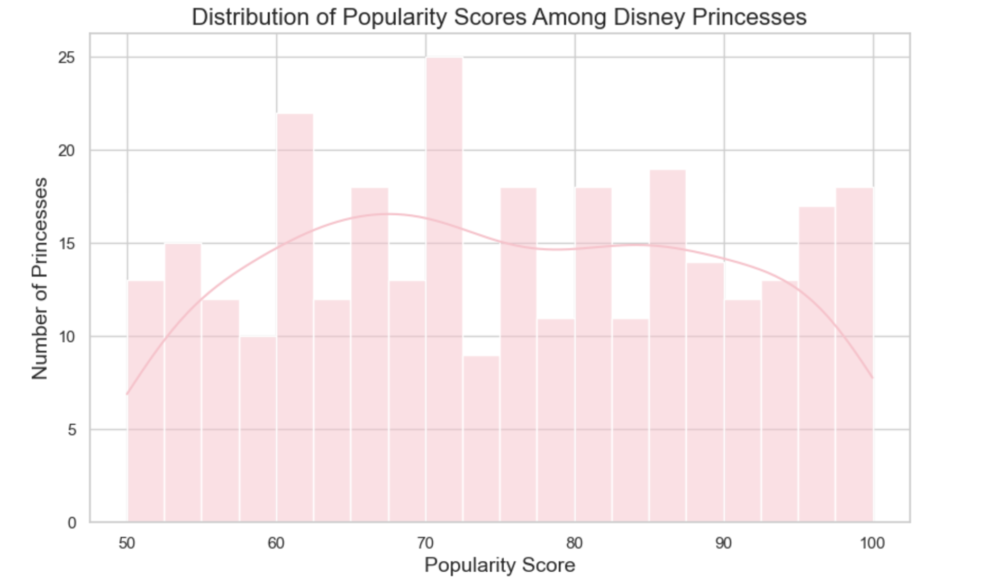
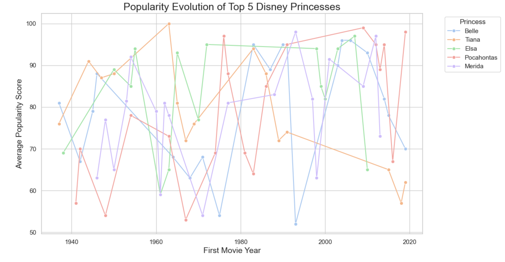

# 👑 Disney Princess Analytics

This project explores the magical world of Disney princesses using data analytics and visual storytelling.  
By analyzing factors like movie success, social media impact, and iconic status, we uncover what makes a princess truly legendary.

---

## 📈 Project Overview

- **Dataset:** Custom dataset with 300 records about Disney princesses
From Kaggle([https://www.kaggle.com/datasets/hamnakaleemds/disney-princess-popularity-dataset])
- **Tools Used:** Python (Pandas, Matplotlib, Seaborn), Tableau Public
- **Focus Areas:** 
  - Popularity score analysis
  - Social media influence (TikTok, Instagram)
  - Movie success metrics (Box Office, Rotten Tomatoes)
  - Character traits (Hair Color, Solo Songs)

---

## 🗂️ Folder Structure
```bash
disney-princess-analytics/
├── data/
│   └── disney_princess_popularity_dataset_300_rows.csv
├── notebooks/
│   └── princess-analytics.ipynb
├── images/
│   ├── popularity_distribution.png
│   ├── top5_princesses_evolution.png
│   ├── haircolor_vs_popularity.png
│   ├──  top5_tiktok_princesses.png
│   └──  cluster_radar.png
├── tableau/
│   └── disney_princess_dashboard.twbx
└── README.md
```
---

## 🔍 Key Insights

- **Popularity Trends:**  
  Ariel and Elsa consistently lead in popularity across decades.

- **TikTok Queens:**  
  Ariel and Cinderella dominate TikTok hashtag views by millions.

- **Hair Color Influence:**  
  Surprisingly, red-haired princesses have the highest average popularity scores.

- **Impact of Solo Songs:**  
  Princesses with solo songs tend to score higher in popularity and media attention.

---

## 📊 Visual Highlights

### 🎀 Popularity Distribution
<p align="center">
  
</p>

---

### 🌟 Top 5 Princesses Popularity Evolution
<p align="center">
  
</p>

---

### 👸 Hair Color vs Popularity
<p align="center">
  
</p>

---

### 🎶 TikTok Stars
<p align="center">
  
</p>

### 💫 3 clusters for princesses (K-meaning clustering):

✅ Cluster 0 → Classic Legends

💫 High box office, high Instagram presence, top search scores — this is the iconic royalty cluster. Think Elsa, Belle, Ariel.
Position: Timeless, highly merchandised, nostalgic.


✅ Cluster 1 → Modern All-Stars

📱 Highest screen time and overall popularity score, solid TikTok & merch stats — this group owns both screen and social attention.

Position: Story-driven, well-balanced appeal, popular across platforms.


✅ Cluster 2 → Media Powerhouses

🎥 Lower screen time but massive TikTok virality & merch sales — true Gen Z fan-magnets.
Position: Viral, short-form queens (likely Moana, Rapunzel, etc.)

### 🌟 Radar Chart: Cluster Comparison

<p align="center">
  
</p>

This radar chart highlights how each princess cluster scores across key metrics like TikTok views, screen time, merchandising, and overall popularity.


---

## 📊 Explore the Interactive Tableau Dashboard

[Disney Analytics: Disney Princess Dashboard on Tableau Public](https://ТВОЯ_ССЫЛКА_НА_ТАБЛО)

This dashboard includes:
- Dynamic filtering by Hair Color, Release Year, and Princess Name
- Key metrics and detailed breakdowns
- Timeline of Iconic Moments

---

## 🚀 How to Run Locally

1. **Install required packages:**

Make sure you have Python 3.8+ installed. Then, install the required Python libraries using pip:

```bash
pip install pandas matplotlib seaborn scikit-learn
```
2. **Download the project files:**
Clone the repository or download it as a ZIP:
```bash
git clone https://github.com/msmaslova/disney-princess-analytics.git
cd disney-princess-analytics
```
3. Open and run the Jupyter Notebook:
Launch Jupyter Notebook and open the main analysis notebook:

princess-analytics.ipynb

4. Run the notebook cell by cell to explore the data, run the cluster analysis, and generate visualizations.
Explore the generated visuals:
You can also view the cleaned dataset with cluster labels in:
disney_princess_clustered.csv


